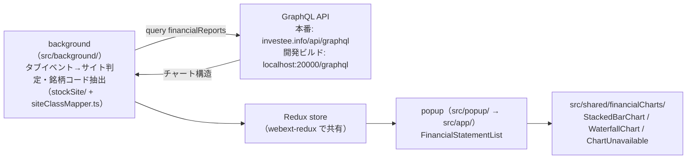

# financial-statement-chrome-extension

investee（https://investee.info）のブラウザ拡張。株式情報サイトの銘柄ページを開くと、background service worker が GraphQL `financialReports` から財務 3 表チャートを取得し、ポップアップに描画する。

## コマンド

| 目的                            | コマンド                                           |
| ------------------------------- | -------------------------------------------------- |
| 依存インストール                | `yarn install`                                     |
| 開発ビルド（ローカル API 接続） | `npx vite build --mode development`                |
| HMR 開発                        | `yarn dev`（dev サーバ起動中のみ動く成果物になる） |
| 本番ビルド                      | `yarn build`（tsc + vite + Firefox MV2 変換）      |
| GraphQL 型生成                  | `yarn compile`（ローカル docker バックエンド必須） |
| lint / 型チェック / テスト      | `yarn lint` / `yarn lint:type` / `yarn test`       |

## アーキテクチャ

- パスエイリアス `@/` = `src/`。UI コンポーネントはクラスコンポーネントが既存の流儀
- チャートの科目・色・積み上げ順は API の返却値（colorRole・配列順序）が契約で、フロントで解釈・並べ替えをしない

## 重要な規約

- **GraphQL クエリは `.graphql` ファイル**（codegen の documents: `**/*.graphql`。gql タグではない）。変更後 `yarn compile`。生成物 `src/__generated__/` はコミットする
- codegen の schema は本番 introspection（`https://investee.info/api/graphql`）を参照。バックエンドの変更を先行開発するときだけ一時的にローカル docker（`http://localhost:20000/graphql`）へ切り替える。`Money` スカラは `number`
- **`src/shared/financialCharts/` は直接編集禁止**。コピー元は financial-statement `application/frontend/src/shared/financialCharts/`。同期はディレクトリごとコピーする（ドリフト確認はコピー元との diff）。`colorRoles.ts` はバックエンド enum との契約で、BE / Web フロント / 拡張の 3 点同時変更
- 接続先切替は `import.meta.env.MODE`（`src/background/financialStatement/apolloClientService.ts`）と `env.mode`（`src/manifest.ts`）。本番 API は CORS ヘッダを返さないため host_permissions の CORS 免除で fetch している。パターンは `https://investee.info/*`（パス `/*` 必須）
- コミットメッセージは `add:` / `change:` プレフィックスの英語 1 行（`git log` 参照）

## 関連リポジトリ・ローカル環境

- financial-statement（通常 `../financial-statement`）: 親リポジトリ + `application/backend`（Rails・submodule）+ `application/frontend`（React・submodule）。`docker compose up` で API が `localhost:20000`、GraphiQL は `http://localhost:20000/graphiql`
- 設計ドキュメントは financial-statement の `docs/architecture/`（チャート契約は `04_frontend.md`）
- ローカル動作確認の手順は [README.md](README.md) を参照

## リリースの順序制約

バックエンドの `financialReports` 本番デプロイ → 本番 API で動作確認 → version up → `yarn build` → ストア申請。順序が逆だと、公開済み拡張が本番に存在しないクエリを投げて表示が壊れる。

## 実機 E2E のヒント

- ブランド版 Chrome 137+ は `--load-extension` フラグを無視する。自動 E2E には Chrome for Testing（`npx @puppeteer/browsers install chrome@stable`）+ puppeteer-core を使う
- ポップアップは `chrome-extension://<拡張ID>/popup/popup.html` をタブとして開いても検証できる（proxyStore 経由で background のデータが届く）。カルーセルの自動再生は localStorage `investeeExtensionIsStatementAutoPlay=false` で停止できる
