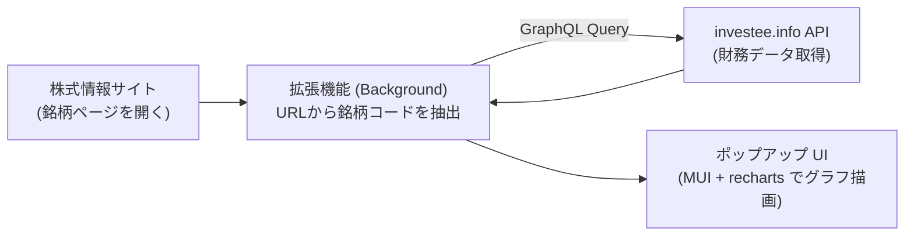

# investee Chrome 拡張機能

株式情報サイトの銘柄ページを開いた際に、ワンクリックでその企業の財務三表（貸借対照表・損益計算書・キャッシュフロー計算書）と ROE・ROA をポップアップ表示するブラウザ拡張機能です。

データは [investee.info](https://investee.info) の GraphQL API から取得し、見やすいグラフとして描画します。

---

## 主な対応サイト

以下のサイトで銘柄ページを開くと拡張アイコンがアクティブになり、ポップアップで財務三表を確認できます。

- **株探** (`kabutan.jp`)
- **みんかぶ** (`minkabu.jp`)
- **Yahoo!ファイナンス** (`finance.yahoo.co.jp`)
- **四季報オンライン** (`shikiho.toyokeizai.net`)
- **バフェット・コード** (`buffett-code.com`)
- **楽天証券** (`rakuten-sec.co.jp`)

---

## 仕組み



---

## 技術スタック

- **フレームワーク / 言語**: React, TypeScript
- **状態管理 / 通信**: Redux Toolkit, Apollo Client (GraphQL)
- **UI / チャート**: Material-UI, recharts
- **ビルドツール**: Vite, CRXJS (@crxjs/vite-plugin)
- **仕様**: Manifest V3 (Chrome) / Manifest V2 (Firefox)

---

## 開発環境と動作確認

### 1. 依存パッケージのインストール

```bash
yarn install
```

### 2. 開発用ビルドの生成

```bash
# 開発モードでビルド（localhost:20000 への接続に対応）
yarn build --mode development
```

### 3. Chrome への読み込み

1. Google Chrome を開き、アドレスバーに `chrome://extensions` を入力して開きます。
2. 画面右上の **「デベロッパーモード」** を ON にします。
3. **「パッケージ化されていない拡張機能を読み込む」** をクリックし、本リポジトリの `dist/` ディレクトリを選択します。
4. 対応サイト（例: `https://kabutan.jp/stock/?code=7203`）を開き、拡張アイコンをクリックして動作を確認します。

※ コードを変更した場合は、再度ビルドを実行したあと拡張機能一覧画面で「更新」アイコンをクリックしてください。

---

## 主なコマンド

```bash
yarn dev       # Vite の開発サーバ起動（HMR）
yarn build     # 本番用ビルド（Chrome用 dist/ と Firefox用 dist-firefox-v2/ を生成）
yarn test      # テストの実行
yarn lint      # ESLint による静的検証
yarn compile   # GraphQL スキーマから TypeScript 型を再生成
```

---

## ディレクトリ構成

```text
financial-statement-chrome-extension/
├── src/
│   ├── background/          # 銘柄ページ検知、銘柄コード抽出、API通信
│   ├── popup/               # ポップアップの画面レイアウト、カルーセル表示
│   ├── shared/              # Web版と共有する財務グラフ描画コンポーネント
│   └── store/               # Redux store 定義
├── manifest.json            # 拡張機能のマニフェスト定義 (MV3)
└── vite.config.ts           # ビルド設定
```

## 利用状況の分析

イベントの定義・GA4 の見方・計測停止設定は [計測ガイド](docs/analytics.md) を参照してください。
