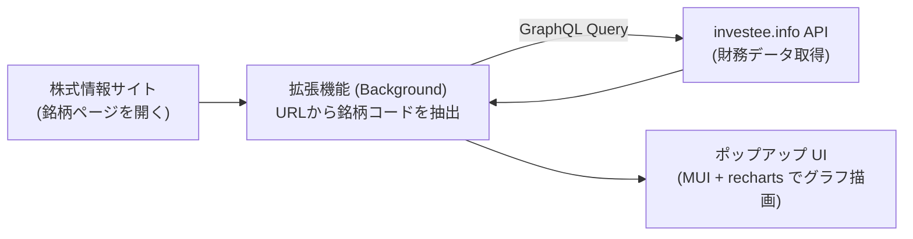

# investee Chrome 拡張機能

株式情報サイトの銘柄ページを開いた際に、ワンクリックでその企業の財務三表（貸借対照表・損益計算書・キャッシュフロー計算書）、過去 5 年のフリー CF と ROE・ROA をポップアップ表示するブラウザ拡張機能です。

データは [investee.info](https://investee.info) の GraphQL API から取得し、見やすいグラフとして描画します。

---

## 主な対応サイト

以下のサイトで銘柄ページを開くと拡張アイコンがアクティブになり、ポップアップで財務三表を確認できます。

- **株探** (`kabutan.jp`)
- **みんかぶ** (`minkabu.jp`)
- **Yahoo!ファイナンス** (`finance.yahoo.co.jp`)
- **四季報オンライン** (`shikiho.toyokeizai.net`)
- **バフェット・コード** (`buffett-code.com`)
- **楽天証券** (`rakuten-sec.co.jp`)

---

## 仕組み


```mermaid
flowchart LR
    Page["株式情報サイト<br>(銘柄ページを開く)"] --> Ext["拡張機能 (Background)<br>URLから銘柄コードを抽出"]
    Ext -->|"GraphQL Query"| API["investee.info API<br>(財務データ取得)"]
    API --> Ext
    Ext --> Pop["ポップアップ UI<br>(MUI + recharts でグラフ描画)"]
```

---

## 技術スタック

- **フレームワーク / 言語**: React, TypeScript
- **状態管理 / 通信**: Redux Toolkit, Apollo Client (GraphQL)
- **UI / チャート**: Material-UI, recharts
- **ビルドツール**: Vite, CRXJS (@crxjs/vite-plugin)
- **仕様**: Manifest V3 (Chrome) / Manifest V2 (Firefox)

---

## 開発環境と動作確認

### 1. 依存パッケージのインストール

```bash
yarn install
```

### 2. 開発用ビルドの生成

```bash
# 開発モードでビルド（localhost:20000 への接続に対応）
yarn vite build --mode development
```

### 3. Chrome への読み込み

1. Google Chrome を開き、アドレスバーに `chrome://extensions` を入力して開きます。
2. 画面右上の **「デベロッパーモード」** を ON にします。
3. **「パッケージ化されていない拡張機能を読み込む」** をクリックし、本リポジトリの `dist/` ディレクトリを選択します。
4. 対応サイト（例: `https://kabutan.jp/stock/?code=7203`）を開き、拡張アイコンをクリックして動作を確認します。

※ コードを変更した場合は、再度ビルドを実行したあと拡張機能一覧画面で「更新」アイコンをクリックしてください。

### 4. 複数データでのポップアップ表示確認

```bash
yarn preview:popup
```

[localhost:8302](http://localhost:8302/) で確認データを選べます。黒字の 2 年度、赤字・債務超過、IFRS・企業公表 ROE、ゼロ・百万円未満・欠損年、長い企業名・未対応形式、指標を持たない旧キャッシュを用意しています。全固定データでは 7 件を表示します。空の取得結果・読み込み中・取得失敗も選べます。

固定データは架空の企業で、金額は API と同じ円です。貸借・PL の左右合計、CF の期首と期末、フリー CF と指標の計算整合性はテストで検証します。実決算を確認する場合は、financial-statement のローカル API を起動し、証券コードをカンマ区切りで指定して「実決算を取得」を押します。クエリと接続先は拡張本体と同じ定義を使います。

表示には本体の Popup・Redux・CSS・ポップアップ HTML を使い、実寸 448×600px の窓内スクロールも再現します。狭い画面では確認窓を横へスクロールできます。これは表示確認用で、background の銘柄検知・Chrome API・永続化・権限の確認には拡張の読み込みが必要です。確認用ページから利用状況は送信しません。

変更前のソースを別ディレクトリに用意した場合は、`POPUP_PREVIEW_SOURCE=/path/to/before/src yarn preview:popup --port 8304` で同じ確認データによる比較もできます。

---

## 主なコマンド

```bash
yarn dev       # Vite の開発サーバ起動（HMR）
yarn build     # 本番用ビルド（Chrome用 dist/ と Firefox用 dist-firefox-v2/ を生成）
yarn test      # テストの実行
yarn lint      # ESLint による静的検証
yarn compile   # GraphQL スキーマから TypeScript 型を再生成
```

---

## ディレクトリ構成

```text
financial-statement-chrome-extension/
├── src/
│   ├── background/          # 銘柄ページ検知、銘柄コード抽出、API通信
│   ├── popup/               # ポップアップの画面レイアウト、カルーセル表示
│   ├── shared/              # Web版と共有する財務グラフ描画コンポーネント
│   └── store/               # Redux store 定義
├── manifest.json            # 拡張機能のマニフェスト定義 (MV3)
└── vite.config.ts           # ビルド設定
```

## 利用状況の分析

イベントの定義・GA4 の見方・計測停止設定は [計測ガイド](docs/analytics.md) を参照してください。
